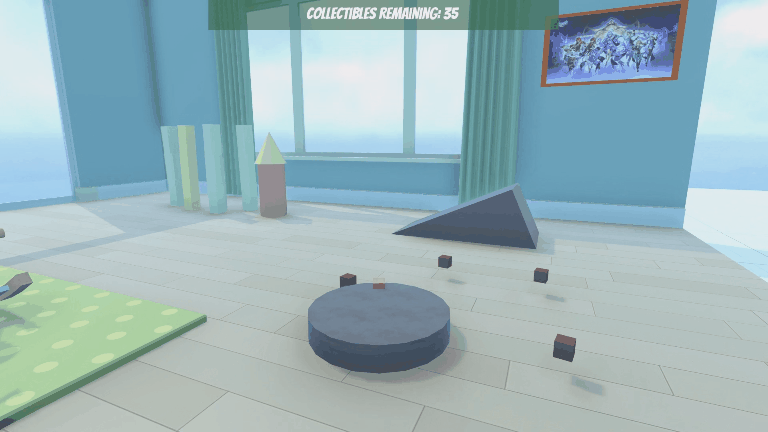
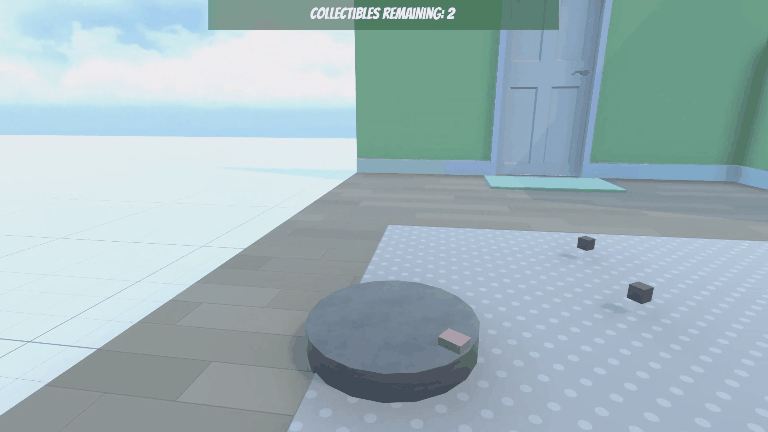
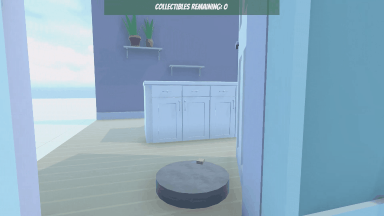
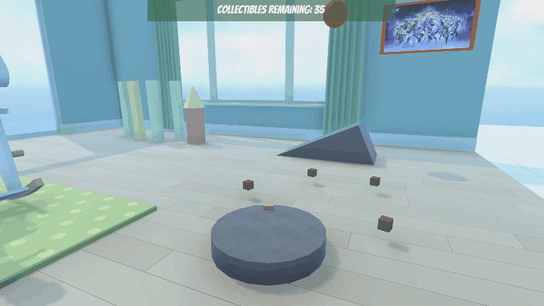

# 🧹 DustBot Sweep: 扫地机器人清扫大作战

## 📖 项目简介 (Project Overview)
**DustBot Sweep** 是一款基于 URP 渲染的 3D 休闲模拟游戏。玩家操纵一台智能扫地机器人，在一个充满灰尘颗粒的房间中穿梭，通过精准的操控清除所有灰尘，还原房间的整洁。

项目基于 **Unity [2022.3.62f1c1 LTS]** 开发。采用了低多边形（Low Poly）的美术风格，旨在提供轻松愉快的游戏体验，同时展示了 Unity 中刚体物理、碰撞检测以及动态 UI 系统的实际应用。

> **截图预览：**
> 
> *图：游戏运行画面，显示扫地机器人正在清理地板上的灰尘颗粒，上方实时显示剩余收集物数量。*

## 🎮 游戏玩法 (Gameplay)

### 核心目标
控制扫地机器人在房间内移动，接触并收集散落在地板和地毯上的所有灰尘颗粒。

### 游戏机制
- **收集系统与反馈**：当扫地机器人与灰尘颗粒碰撞时，灰尘会被收集并消失。伴随特有的收集音效和粒子爆发特效，给予玩家即时的视觉与听觉确认，同时计数器减一。
- **胜利条件与反馈**：当收集完最后一个灰尘颗粒，屏幕上方的 **"COLLECTIBLES REMAINING"（剩余收集物）** 数字变为 **0** 时，出现特殊的庆祝特效和音效，关卡完成。
- **物理交互**：扫地机器人具有真实的物理反馈，在推动小型物体或转向时会受到惯性影响。
- **动态跟随视角**：采用平滑的第三人称跟随相机，自动锁定机器人位置并智能避开障碍物，确保玩家在狭窄家具间也能清晰观察清洁路径。  

>&nbsp;&nbsp;&nbsp;  
>&nbsp;&nbsp; *图：扫地机器人扫过灰尘，灰尘消失并伴随粒子爆发特效，同时上方数字减一。*  

>&nbsp;&nbsp;&nbsp;  
>&nbsp;&nbsp; *图：收集完最后一个灰尘颗粒，触发庆祝特效。*

## ⌨️ 操作指南 (Controls)

| 按键 | 动作 |
| :--- | :--- |
| **W / ↑** | 向前移动 (Forward) |
| **S / ↓** | 向后移动 (Backward) |
| **A / ←** | 向左旋转 (Rotate Left) |
| **D / →** | 向右旋转 (Rotate Right) |

## 🛠️ 技术实现亮点 (Technical Highlights)

本项目主要运用了以下 Unity 核心技术：

1. **核心架构与设计模式 (Architecture & Patterns)**
   - **事件驱动系统**：使用 `System.Action<int>` 委托实现管理器与 UI 的解耦，消除 Update 轮询，提升性能。
   - **单例模式**：`CollectibleManager` 采用单例设计，确保全局游戏状态（如胜利条件、剩余计数）的唯一性和可访问性。
   - **模块化脚本设计**：将移动 (`PlayerController`)、收集 (`Collectible`)、收集物管理 (`CollectibleManager`) 分离，遵循单一职责原则 (SRP)。

2. **物理与碰撞检测 (Physics & Collisions)**
   - **Rigidbody**：扫地机器人使用了 `Rigidbody` 组件，通过 `MovePosition` 实现符合物理规律的移动，而非直接修改 Transform，确保了与环境的真实交互。
   - **Colliders**：
     - 机器人使用了 `BoxCollider` 作为主体。
     - 灰尘颗粒使用了带有 `IsTrigger` 属性的 `BoxCollider`，以便在不产生物理反弹的情况下检测进入范围。

3. **脚本逻辑 (Scripting Logic)**
   - **PlayerController.cs**：处理用户输入，将其转换为机器人的移动和旋转向量。
   - **Collectible.cs**：附着在灰尘颗粒上，使用 `OnTriggerEnter(Collider other)` 方法检测玩家标签(Tag: "Player")。一旦检测到，实例化粒子特效，播放音效，销毁灰尘对象，并通知 CollectibleManager。
   - **CollectibleManager.cs**：单例模式管理收集物状态，调用委托维护灰尘总数，管理数量的文本显示，并在数量为 0 时触发胜利逻辑(实例化庆祝特效并播放音效)。

4. **用户界面 (UI System)**
   - 使用 Unity 的 `Canvas` 和 `TextMeshPro` 构建 HUD。
   - 通过代码动态更新文本内容：`textComponent.text = $"Collectibles remaining: {count}";`，确保玩家能实时掌握进度。
   
5. **摄像机系统 (Camera System)**
   - **智能跟随策略**：采用 `Cinemachine Virtual Camera` 的 Transposer 组件，选用 Simple Follow With World Up 绑定模式。该算法策略性地将相机的位置跟随与目标旋转解耦，确保在扫地机器人频繁转向时，镜头始终保持稳定的世界坐标朝向，有效避免玩家晕眩。
   - **动态避障处理**：集成 `Cinemachine Collider` 扩展模块，基于射线检测（Raycasting）实时计算最佳观测距离。当检测到墙壁或家具遮挡时，自动沿视线轴向推近相机或穿透模型，确保目标永远可见。
   - **无代码/低代码架构**：利用 Cinemachine 系统，实现了无需复杂手写代码逻辑的高性能相机控制，提升了项目的可维护性与扩展性。
&nbsp;   
&nbsp; *图：扫地机器人走进门后，相机自动穿透模型(或拉近)。*

6. **场景设计 (Scene Design)**
   - 构建了包含卧室、厨房、客厅三个区域的房间环境，三个区域有各自特色的家具和物品，但整体风格保持一致。
      - 搭建了弹力球与坡道相撞后击倒积木塔的场景。添加了球撞击和积木落下碰撞的声音并通过调整 `Audio Source` 组件的属性来展示对真实的物理反馈的模拟。(Unity Play 只保留积木塔让玩家能撞击来提高场景交互性( WebGL版本有声音bug),还原场景需要在 Unity 编辑器中激活 Ball 游戏对象)
      - 通过 `AudioSource` 组件添加了水沸腾、冰箱电流以及鸟叫声的 3D 音频效果来模拟真实环境的声音，添加了背景音乐增强场景的整体氛围。  
   
 *图：球撞击积木塔，积木散落。*

7. **其他场景**
   - 实现了基于Rigidbody2D的角色控制器，借鉴经典玩法“推箱子”设计并实现了简单的正交顶视图下的灰尘清除游戏场景。
>&nbsp;&nbsp; 
> *图：简化的2D场景游戏运行画面，Assets/_UnityEssentials/Scenes/5_TopDown_2D_Scene 1 查看*

## 🚀 如何体验 (How to Experience)

###   1. 在线试玩 (推荐)
无需安装任何软件，直接在浏览器中体验完整游戏：

👉 **[点击此处开始试玩 (Unity Play)](https://play.unity.com/en/games/2f06af59-cda3-489e-bc7c-466a12e3fe50/dustbot-sweep)**

> 💡 **操作提示**：支持键盘 **WASD** 或 **方向键** 控制。  
> 💡 **建议**：推荐使用 **Chrome** 或 **Edge** 浏览器以获得最佳性能。首次加载可能需要几秒钟，请耐心等待资源解压。  

> 
> *图：游戏主菜单 (Main Menu) ，点击 Primary Scene 按钮即可开始体验游戏主体。*

---

###   2. 本地运行 
如果您希望查看项目源码、场景结构或在 Unity 编辑器中调试，请按以下步骤操作：

#### 前置要求 (Prerequisites)

-  **Unity Editor**: 推荐版本 **2022.3.62f1c1 LTS** (其他版本可能导致材质或脚本编译错误)。
-  **IDE**: Visual Studio Code。
-  **模块依赖**：
   -   Universal Render Pipeline (URP)。
   -   WebGL Build Support (如需构建网页版)。

#### 安装步骤 (Installation Steps)

1.  **克隆仓库**: 浅克隆（只下载最新版本，不包含历史记录）
    ```bash
    git clone --depth 1 https://github.com/buxuebulian/MyGame.git
    cd MyGame
    ```

3.  **打开项目**:
    *   启动 Unity Hub。
    *   点击 "Add" -> "Add project from disk"。
    *   选择刚才克隆的根目录文件夹。
    *   等待 Unity 导入资源和编译脚本（首次打开可能需要 5-10 分钟）。

4.  **运行场景**:
    *   进入 `Assets/_UnityEssentials/Scenes/` 目录。
    *   打开 `[0_MainMenu_Scene.unity]` 或 `[6_Bonus_Custom_Scene.unity]`。
    *   点击 **Play** 按钮即可体验。
## 📂 项目结构 (Project Structure)

```text
Assets/_UnityEssentials/
├── Scripts/           # C#脚本(PlayerController,CollectibleManager,etc.)
├── Scenes/            # 场景文件
├── Audio/             # 音效与音乐
├── Fonts/             # 字体
├── Materials/         # 材质
├── Models/            # 3D模型
├── Prefabs/           # 预制体
├── Source Files/      # 其他资源(动画等)
├── Sprites/           # 精灵图片
└── Textures/          # UI贴图等
```
---

*Built with Unity 2022.3.62f1c1 LTS*